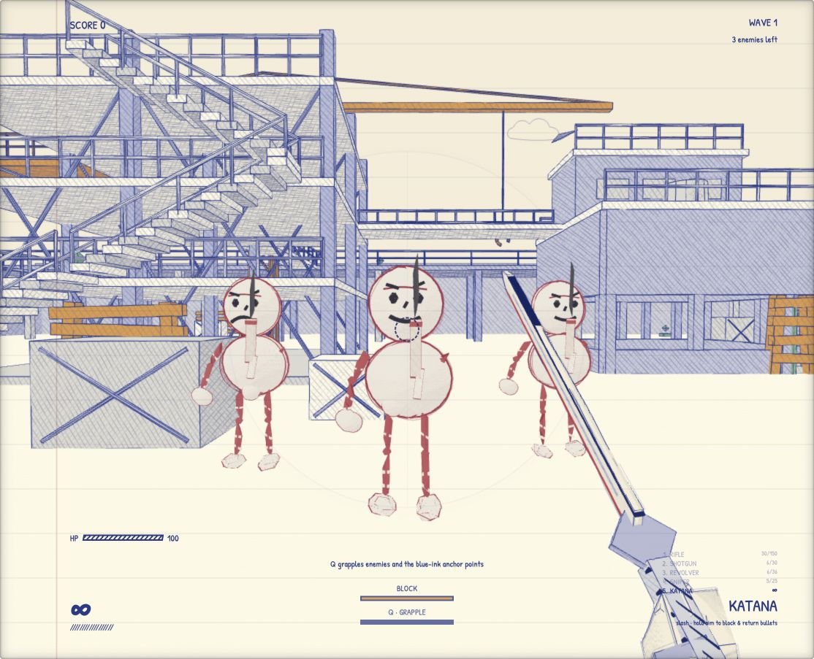
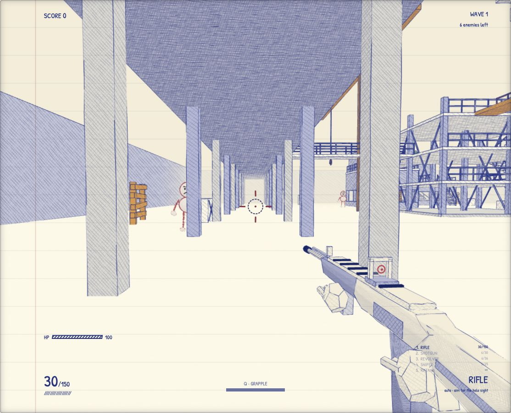
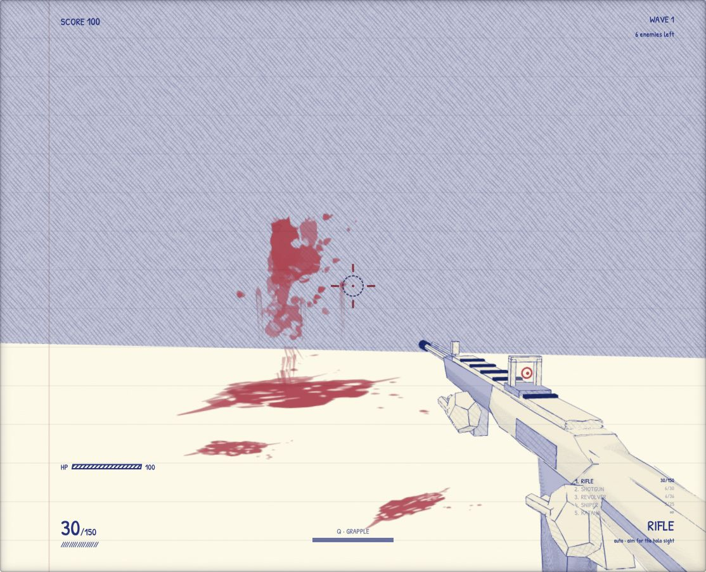

# BALLPOINT BREACH

**Drawn in ink. Built to break.**

BALLPOINT BREACH is a complete procedural browser FPS inspired by a [short gameplay reference](https://x.com/EvanMilenko/status/2095684248220881049). The arena, first-person weapons, enemies, boss, effects, textures, and UI are generated in TypeScript; the project contains no downloaded models or texture packs.



## Screenshots

| Construction arena | Persistent death ink |
| --- | --- |
|  |  |

## Generation prompt

The complete reconstruction prompt—including the visual contract, measured scale, gameplay systems, rejection list, QA modes, and definition of done—is available in [GENERATION_PROMPT.md](GENERATION_PROMPT.md).

## Run locally

Requirements: Node.js 20 or newer.

```bash
npm install
npm run dev
```

Open `http://127.0.0.1:8901`. The development server intentionally uses port 8901.

Production verification:

```bash
npm run typecheck
npm test
npm run build
```

## Controls

| Input | Action |
| --- | --- |
| Mouse | Look |
| WASD | Move |
| Shift | Sprint |
| Space | Jump |
| Left mouse | Fire / slash |
| Right mouse | Aim / katana block |
| R | Reload |
| 1–5 / wheel | Switch weapon |
| Q | Grapple an enemy or anchor |
| Escape | Release pointer and pause |

Click **CLICK TO ENTER THE PAGE** to acquire pointer lock. A paused game resumes when the page is clicked again.
If the browser rejects Pointer Lock, the game automatically continues in unlocked fallback mode: move the cursor to look, use the same keyboard/mouse controls, and press Escape to pause.

## Game loop

Five automatically advancing waves combine Grunts, Rushers, Heavies, and Marksmen. Wave five introduces **THE DOODLER**, whose telegraphed move set includes a charge, pencil sweep, ground slam, projectile volley, and summons. Clears restore some health and ammunition. Defeat and victory both support a clean in-place restart.

The construction complex spans a `72 × 78` playable floor, with a long rear undercroft, remote west return route, separated buildings, and connected elevated paths. Enemy deaths break into directional ink fragments and leave persistent procedural splats instead of intact ragdolls. Camera and weapon motion share one distance-driven gait phase, tuned to the reference rifle cadence.

The arsenal contains:

- an automatic 30-round rifle with a compact square holographic sight;
- a six-round pump shotgun with pellet rays and heavy knockback;
- a precise heavy revolver;
- a five-round bolt-action sniper with a circular scope;
- a katana with an arc slash, finite block stamina, and timed projectile returns.

Q fires a bounded blue line. Enemy hits pull the target toward the player; designated arena anchors lightly pull the player. World ray tests prevent grapples and gunfire from passing through walls.

## Architecture

- `src/game/` owns the main loop, state, world queries, supplies, and grapple integration.
- `src/render/` contains the shared cross-hatch shader and cached outline helper.
- `src/level/` procedurally assembles the construction arena, colliders, waypoint graph, ledges, supplies, grapple anchors, and breakables.
- `src/player/` and `src/physics/` implement the kinematic capsule controller.
- `src/combat/` contains weapon definitions, state machines, and procedural viewmodels.
- `src/enemies/` contains reusable doodle rigs, finite-state AI, hit zones, boss logic, and the projectile pool.
- `src/waves/` owns deterministic five-wave pacing.
- `src/effects/`, `src/audio/`, and `src/ui/` provide bounded feedback systems.

The host keeps simulation and visuals separate: weapons emit hitscan/melee requests, enemies emit attacks and lifecycle events, and `Game` resolves those requests against the shared arena queries.

## Notebook rendering

The cream paper, blue horizontal rules, red margin, and subtle grain are screen-space CSS layers and therefore remain fixed while the camera moves. Geometry uses a shared indigo outline cache plus a custom `DoodleMaterial`:

1. `dot(normal, lightDirection)` produces a stable light value.
2. The value is quantized into four tonal bands.
3. `gl_FragCoord` generates two non-identical diagonal stroke families plus a denser, near-horizontal dark-band family.
4. Seeded phase, bend, pressure, and short continuity gaps keep the strokes irregular while remaining static in time.
5. `fwidth` and `smoothstep` antialias the strokes to reduce shimmer.

Visible mesh edges are subdivided once into deterministic wobbled primary strokes and intermittent, faint displaced pen passes. The duplicate pass is stored in the same line geometry, so the hand-traced look does not add a second draw call per object.

The arena uses cream/lavender paper surfaces, enemies and damage use red ink, construction and breakables use orange, and supplies use green. Viewmodels render on a dedicated camera layer so they preserve self-occlusion without disappearing into nearby world geometry.

## QA modes

`?capture=1` starts an unlocked, deterministic visual-review run. `?capture=1&stress=1` adds 20 active enemies for a bounded performance check. `?capture=1&ink=1` triggers a deterministic reference-style death after the opening banner for multi-timepoint visual review. `?capture=1&view=rear` and `view=west` expose the remote routes for multi-view geometry review. These modes do not replace the normal pointer-lock game.

## Project documents

- [Generation prompt](GENERATION_PROMPT.md)
- [Reference analysis](reference-analysis.md)
- [Layout contract](layout-contract.md)
- [Acceptance contract](ACCEPTANCE.md)
- [Fidelity self-review](self-review.md)
- [Permanent user feedback signals](user-signals.md)

## License and attribution

The project is licensed under Apache-2.0. See [LICENSE](LICENSE) and [THIRD_PARTY_NOTICES.md](THIRD_PARTY_NOTICES.md) for attribution, including the MIT-licensed `video2threejs` workflow that informed the reconstruction process. Runtime dependencies retain their respective upstream licenses.
